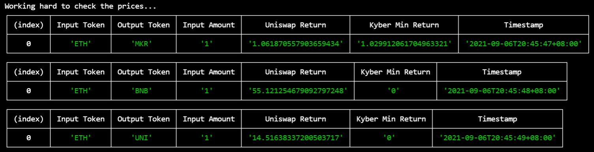

# Arbitrage Hunter

Super simple bot to listen in on two DEX - Kyber &  Uniswap - to compare crypto rates. As time is of the essence in arbitrage exploitation, although more DEX & tokens can be added, it's advisable to focus on main pools for selected tokens to secure more arbitrage opportunities. Be mindful that other bots are also scouring for arbitrages and the booty goes to the first to close the price difference. 

For final assignment of SGBT4
PT7210027 Mark Tan
## `npm run start`

### Potential enhancements

- Automatic computation of arbitrage
- Automatic execution of flash loans to exploit arbitrage